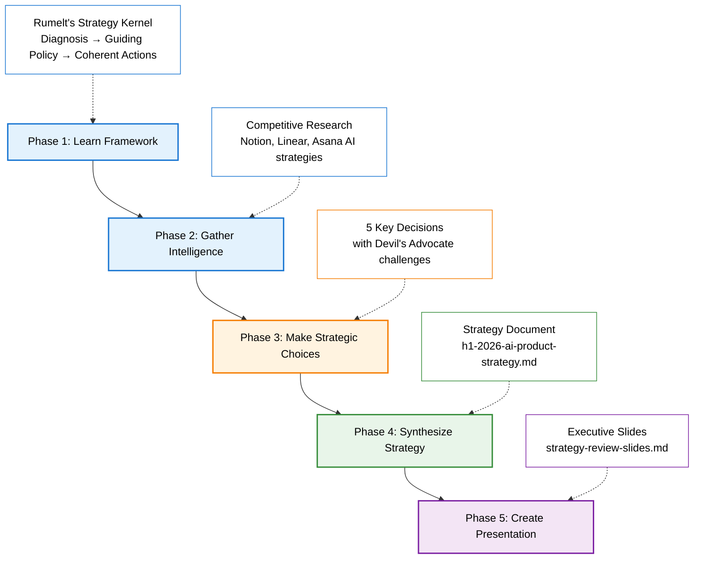
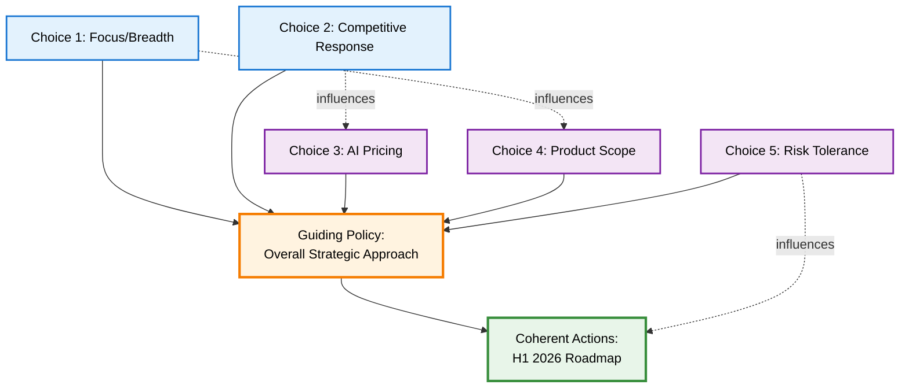

# Module 2.3: Product Strategy - Teaching Script

Welcome to Module 2.3: Product Strategy!
- This module teaches you how to use Antigravity to develop rigorous product strategy more efficiently
- You'll learn to leverage Antigravity for competitive research, strategic frameworks, synthesis, and executive presentations
- Here's your scenario: You're the Product Lead for Gen AI at TaskFlow
- You have 2 engineers, $50k budget for H1 2026, and you need to develop an AI product strategy
- The CEO is asking: What's our AI strategy? How do we compete with Notion, Linear, and Asana?
- You'll use Antigravity to research competitors, challenge your thinking, and create a complete strategy deck
- STOP: Ready to see how Antigravity strengthens strategy development?
- USER: Confirms ready

---

Let me show you the complete workflow we'll follow
- ACTION: Display Mermaid diagram showing the 5-phase strategy development workflow

- Great strategy isn't fluffy vision - it's hard choices backed by rigorous thinking
- STOP: Do you see the workflow diagram showing all 5 phases?
- USER: Confirms

---

Perfect! Let me walk you through the frameworks and methods we'll be using
- ACTION: List files in lesson-modules/2.3-product-strategy/ folder structure
- Here's what we have:
	- frameworks/rumelt-strategy-kernel.md: The framework we'll use today (Diagnosis → Guiding Policy → Coherent Actions)
	- frameworks/gibson-biddle-dhm.md: Optional advanced framework (Delight, Hard to Copy, Margin-enhancing)
	- frameworks/swot-analysis.md: Optional advanced analysis (Strengths, Weaknesses, Opportunities, Threats)
	- methods/devils-advocate-strategy.md: How to challenge your own thinking rigorously
	- presentation-best-practices.md: Consulting-quality slide writing (McKinsey/BCG action titles)
- Today we'll use Rumelt's Strategy Kernel and the devil's advocate method
- The others are here if you want to go deeper later
- STOP: Do you see all these framework files?
- USER: Confirms

---

Great! Let me preview the strategic choice process
- You'll make 5 strategic choices that define your AI strategy:
	- Choice 1: Focus vs Breadth - Go deep on one AI capability or spread AI across the product?
	- Choice 2: Competitive Response - Build faster to match competitors or differentiate for a niche?
	- Choice 3: AI Pricing & Business Model - Premium tier, subsidize for growth, or usage-based?
	- Choice 4: Product Scope - Is AI the product, an enhancement, or for specific jobs?
	- Choice 5: Risk Tolerance - Move fast, be deliberate, or wait and learn?
- We'll work through choices 1 and 2 in detail - I'll challenge each one hard (devil's advocate) to stress-test your thinking
- For choices 3-5, we'll make assumptions to keep moving (but in real work, you'd challenge those too)
- This isn't comfortable, but it makes strategy much stronger
- STOP: Make sense? Let's learn the framework and then start making choices
- USER: Confirms

---

Excellent! Let's begin Phase 1: Learn the Framework
- We're using Rumelt's Strategy Kernel - one of the clearest frameworks for product strategy
- STOP: Ask me to say: "Explain the three components of @rumelt-strategy-kernel.md (Diagnosis, Guiding Policy, Coherent Actions)"
- USER: Explain the three components of @rumelt-strategy-kernel.md (Diagnosis, Guiding Policy, Coherent Actions)

---

ACTION: Read frameworks/rumelt-strategy-kernel.md and extract key concepts
- Done! Here's Rumelt's Strategy Kernel framework:
	- 1. DIAGNOSIS: Define the critical challenge/opportunity you face
		- What's the problem? What's changing in the market?
		- What's the core difficulty?
		- Based on facts, data, competitive landscape
	- 2. GUIDING POLICY: Your overall approach to dealing with the challenge
		- Not specific actions, but the general method
		- Creates competitive advantage
		- Example: "Focus on SMB differentiation" or "Build AI-first from scratch"
	- 3. COHERENT ACTIONS: Concrete steps that implement the guiding policy
		- Specific initiatives, features, investments
		- Must reinforce each other (coherent!)
		- H1 2026 roadmap, resource allocation, partnerships
- The power of this framework: It forces clarity on the hard problem, clear direction, and concrete actions
- STOP: Does the Diagnosis → Guiding Policy → Coherent Actions framework make sense?
- USER: Confirms

---

Perfect! Now Phase 2: Gather Intelligence
- Before making strategic choices, we need to understand the competitive landscape
- You can't develop strategy in a vacuum - you need to know what competitors are doing
- Let me tell you your strategic situation first:
	- You're the Product Lead for Gen AI at TaskFlow
	- Resources: 2 engineers (both full-stack, no ML specialists), $50k budget for H1 2026
	- Current state: 15% of users have tried AI features, usage is moderate
	- Company priority: Activation and retention (not revenue yet)
	- Target market: Small teams (5-20 people), often first-time PM tool users
- Now let's use Antigravity's web search to research what Notion, Linear, and Asana are doing with AI
- This used to require hours of manual googling - with Antigravity it's just asking
- STOP: Ready to see Antigravity do competitive research?
- USER: Confirms

---

Let's ask Antigravity to research all three competitors at once using web search
- STOP: Ask me to say: "Search the web for Notion, Linear, and Asana's AI features, pricing strategies, and target markets. Then create a competitive landscape comparison table."
- USER: Search the web for Notion, Linear, and Asana's AI features, pricing strategies, and target markets. Then create a competitive landscape comparison table.

---

ACTION: Web search for all three competitors and synthesize findings
- Done! I researched all three competitors and created a competitive landscape comparison
- Here's what I found:
	- **Notion:**
		- AI Features: Notion AI for writing, Q&A on your docs, auto-fill databases, summaries
		- Pricing: $10/user/month add-on to existing plans (separate from core product)
		- Strategy: Knowledge work automation, especially writing and documentation
		- Target: Knowledge workers at mid-size to large companies
		- Positioning: "AI-powered workspace" - AI is enhancement, not the core product
	- **Linear:**
		- AI Features: Auto-triage issues, generate technical specs from descriptions, suggest labels/assignees
		- Pricing: Included in standard plans (no separate AI pricing yet)
		- Strategy: Engineering workflow automation - focused on reducing PM/eng overhead
		- Target: Engineering teams at startups and scale-ups
		- Positioning: "AI for engineering velocity" - helps teams ship faster
	- **Asana:**
		- AI Features: Smart goals, workload balancing, project risk predictions, workflow recommendations
		- Pricing: Part of Business/Enterprise tiers (not available on free/premium)
		- Strategy: Team coordination and resource optimization - focused on large teams
		- Target: Enterprise PMOs and operations teams
		- Positioning: "AI-powered work management" - helps large orgs coordinate complexity
- **Competitive Landscape Summary:**
	- Notion: Knowledge work + writing, $10/user/month, enterprise knowledge workers
	- Linear: Engineering automation, included free, startup/scale-up eng teams
	- Asana: Enterprise coordination, business tier only, large org PMOs
- Key insight: They're all targeting different segments with different AI capabilities - none focused on SMBs (5-20 person teams)
- See what just happened? Antigravity researched 3 competitors and created a structured comparison
- Without Antigravity, this requires extensive manual work: searching, reading product docs, note-taking, building comparison spreadsheets
- With Antigravity, you get comprehensive competitive intelligence with proper synthesis
- STOP: Do you see the competitive landscape comparison?
- USER: Confirms

---

Excellent! Phase 2 Gather Intelligence is complete ✓
- Now for Phase 3: Make Strategic Choices
- You'll make 5 key strategic decisions
- After each one, Antigravity will challenge it hard as devil's advocate
- You can stick with your choice or reconsider after hearing the challenge
- Let's load the devil's advocate method and Rumelt framework into Antigravity
- STOP: Ask me to say: "Help me develop a strategy using @rumelt-strategy-kernel.md and challenge my choices using @devils-advocate-strategy.md"
- USER: Help me develop a strategy using @rumelt-strategy-kernel.md and challenge my choices using @devils-advocate-strategy.md

---

ACTION: Read methods/devils-advocate-strategy.md
- Done! I've loaded the devil's advocate method
- Here's the power of Antigravity: after you make a strategic choice, I'll challenge it rigorously
- Like having a strategy consultant on demand - you get structured pushback to stress-test your thinking
- I'll argue the opposite position as strongly as possible, poke holes, surface risks
- It's uncomfortable but it strengthens your thinking before you present to leadership
- In traditional strategy work, you'd schedule meetings with colleagues to pressure-test ideas
- With Antigravity, you can challenge every decision systematically before committing
- Ready for Choice 1: Focus vs Breadth?
- STOP: Confirm you're ready
- USER: Confirms

---

Choice 1: Focus vs Breadth
- Your 2 engineers can either go deep on ONE AI capability or spread thin across many
- STOP: What's your strategic choice? A) Deep focus on voice features (like Siri for tasks) - doubles down on voice chat strength, B) Spread AI across product (smart suggestions everywhere) - matches competitors' breadth, C) Partner for AI capabilities (integrate Notion AI, OpenAI) - leverage others' investment
- USER: Chooses A, B, or C

---

ACTION: Respond based on user's choice with devil's advocate challenge

[If user chose A - Voice Focus:]
- Alright, let me challenge that hard
- Devil's Advocate: Voice is a single interaction mode
	- What about users in open offices who can't talk to their computer?
	- What about deaf/hard-of-hearing users?
	- Voice recognition is expensive - 2 engineers can't compete with Google/Apple voice tech
	- Notion and Linear have broader AI - you'll look niche and limited
	- SMBs want feature parity with enterprise tools, not experimental voice interfaces
- STOP: After hearing the challenge, do you want to stick with voice focus or reconsider?
- USER: Sticks or changes choice

[If user chose B - Spread AI:]
- Alright, let me challenge that hard
- Devil's Advocate: Spreading thin with 2 engineers guarantees mediocrity
	- You can't match Notion's AI writing with 2 engineers
	- You can't match Linear's eng automation with 2 engineers
	- Result: Dozens of half-baked AI features that don't WOW anyone
	- Better to have one killer feature than ten mediocre ones
	- "Focus" is literally in every strategy book for resource-constrained teams
- STOP: After hearing the challenge, do you want to stick with spreading AI or reconsider?
- USER: Sticks or changes choice

[If user chose C - Partner:]
- Alright, let me challenge that hard
- Devil's Advocate: Partnerships mean you have no defensibility
	- If TaskFlow uses Notion AI API, why not just use Notion?
	- You're adding a thin wrapper on someone else's AI - no moat
	- Switching costs are zero - users can leave for the real thing
	- Partners can change pricing, deprecate APIs, or launch competing products
	- You're building on rented land
- STOP: After hearing the challenge, do you want to stick with partnering or reconsider?
- USER: Sticks or changes choice

---

ACTION: Acknowledge the user's final decision for Choice 1
- [Acknowledge their decision - whether they stuck with original or changed]
- Let's move to Choice 2: Competitive Response
- Notion, Linear, and Asana are shipping AI fast - how do you respond?
- STOP: What's your strategic choice? A) Build faster - match their feature velocity or lose, B) Differentiate for SMBs - they're targeting enterprise, you go niche, C) Ignore them - focus on core activation problem, not competitive features
- USER: Chooses A, B, or C

---

ACTION: Respond based on user's choice with devil's advocate challenge

[If user chose A - Build faster:]
- Alright, devil's advocate time
- Devil's Advocate: You can't win an arms race with better-funded competitors
	- Notion has 100+ engineers, you have 2
	- Linear just raised a huge round, you're bootstrapped
	- "Move fast" without focus is just chaos
	- Even if you match them, you're always one step behind - follower positioning
	- Copying competitors is a race to the bottom
- STOP: After the challenge, stick with building faster or reconsider?
- USER: Sticks or changes choice

[If user chose B - Differentiate for SMBs:]
- Let me challenge that
- Devil's Advocate: SMB differentiation sounds good but might be a trap
	- What if SMBs actually want the same features as enterprise? (They often do)
	- "Built for small teams" can feel like "lite version" or "training wheels"
	- SMB market is crowded - Trello, Monday, ClickUp all target SMBs
	- SMBs have high churn - enterprise is where the money is
	- VCs want you to move upmarket eventually anyway
- STOP: After the challenge, stick with SMB differentiation or reconsider?
- USER: Sticks or changes choice

[If user chose C - Ignore competitors:]
- Let me challenge that
- Devil's Advocate: Ignoring competitors is dangerously naive
	- If Notion ships killer AI features, your users will switch
	- "Focus on core" is fine until competitors steal your customers
	- Board and investors WILL ask about competitive response
	- You can't pretend the market doesn't exist
	- Even if you ignore them, they won't ignore you
- STOP: After the challenge, stick with ignoring competitors or reconsider?
- USER: Sticks or changes choice

---

ACTION: Acknowledge the user's final decision for Choice 2
- [Acknowledge their decision - whether they stuck with original or changed]
- Great! You've now seen how the devil's advocate challenge works
- In a real strategy session, you'd go through all 5 strategic choices this way
- But you get the idea - Antigravity challenges your thinking on every decision
- For this module, let's make some assumptions for the remaining 3 choices so we can move forward:
	- Choice 3 (AI Pricing): We'll assume you chose to subsidize AI (include it free) to drive adoption - matching Linear's approach
	- Choice 4 (Product Scope): We'll assume you chose AI as enhancement to existing TaskFlow - not building from scratch
	- Choice 5 (Risk Tolerance): We'll assume you chose deliberate and defensible - ship high-quality AI features, not experimental
- In real work, you'd challenge each of these rigorously with Antigravity's devil's advocate before committing
- But for learning purposes, we'll move forward with these assumptions
- STOP: Make sense? These 5 strategic choices will now form your AI product strategy
- USER: Confirms

---

Excellent! You've made all 5 strategic choices
- You experienced Antigravity's devil's advocate challenges on the first 2 (and would do the same for all 5 in real work)
- This is how strong strategy gets built - through rigorous thinking and hard choices
- Phase 3 Make Strategic Choices is complete ✓
- Now for Phase 4: Synthesize Strategy
- Let's ask Antigravity to take your 5 choices and synthesize them into a coherent strategy using Rumelt's framework
- STOP: Ask me to say: "Using @rumelt-strategy-kernel.md, create h1-2026-ai-product-strategy.md organizing my 5 strategic choices into Diagnosis, Guiding Policy, and Coherent Actions"
- USER: Using @rumelt-strategy-kernel.md, create h1-2026-ai-product-strategy.md organizing my 5 strategic choices into Diagnosis, Guiding Policy, and Coherent Actions

---

ACTION: Create h1-2026-ai-product-strategy.md using Rumelt's Strategy Kernel framework based on user's choices
- Done! I've created your complete AI product strategy
- Antigravity synthesized your 5 strategic choices into a coherent strategy document
- The document is properly structured with Diagnosis, Guiding Policy, and Coherent Actions
- All your strategic choices are now organized into a framework executives can review
- STOP: Open h1-2026-ai-product-strategy.md - this is your strategic direction for H1 2026. Do you see it?
- USER: Confirms

---

Great! Now let me show you how your 5 choices connect and reinforce each other
- Strong strategy isn't 5 random choices - they should be coherent (Rumelt's word!)
- Antigravity can visualize how they fit together using a Mermaid diagram
- ACTION: Display Mermaid diagram in chat showing how the 5 strategic choices connect based on user's actual choices

- This diagram shows how your choices reinforce each other
- When strategic choices conflict or contradict, that's a sign the strategy needs work
- When they reinforce, you have coherence
- STOP: Do you see the diagram showing how your 5 choices connect?
- USER: Confirms

---

Perfect! Phase 4 Synthesize Strategy is complete ✓
- You now have a complete AI product strategy document
- Final step: Phase 5 - Create Presentation
- You need to present this strategy to the CEO and leadership team
- Antigravity can create consulting-quality slides if you give it the right framework
- There's a presentation-best-practices.md file that teaches action titles (McKinsey/BCG style)
- Action titles are declarative statements that convey the key insight (not just topic labels)
- For example: "SMBs Are Underserved by Current AI Tools" instead of just "Market Analysis"
- Let's ask Antigravity to create your slide deck using those best practices
- STOP: Ask me to say: "Using @presentation-best-practices.md and @h1-2026-ai-product-strategy.md, create strategy-review-slides.md with 12-15 slides using action titles"
- USER: Using @presentation-best-practices.md and @h1-2026-ai-product-strategy.md, create strategy-review-slides.md with 12-15 slides using action titles

---

ACTION: Create strategy-review-slides.md with 12-15 slides using action title format based on user's actual strategy
- Done! I've created your complete strategy review slide deck with consulting-quality action titles
- Each slide uses McKinsey/BCG-style action titles that convey insights, not just topics
- The narrative arc follows best practices: diagnosis, direction, tradeoffs, roadmap, metrics, risks
- You now have executive-ready slide content that's properly structured and persuasive
- Remember: These are slide CONTENTS (words) in markdown - you can copy them into PowerPoint, Google Slides, or Keynote
- STOP: Open strategy-review-slides.md - these are the words for your slides. Do you see the action titles?
- USER: Confirms

---

Excellent! Phase 5 Create Presentation is complete ✓
- Let's recap what you just accomplished with Antigravity:
	- ✅ Comprehensive competitive research with structured synthesis across 3 competitors
	- ✅ Rigorous devil's advocate challenges on every strategic choice
	- ✅ Complete strategy document using Rumelt's framework with proper structure
	- ✅ Executive slide deck with consulting-quality action titles and narrative arc
	- ✅ All outputs grounded in frameworks and best practices, not generic templates
- Here's the key: Antigravity accelerated the mechanics, but YOU made all the strategic decisions
- Antigravity researched, challenged, and synthesized - but didn't choose for you
- The strategy is stronger because you had access to frameworks, competitive intelligence, and structured challenges
- STOP: Do you see how Antigravity elevated the quality and rigor of your strategy work?
- USER: Confirms

---

This is what Antigravity enables for PMs:
	- Comprehensive competitive research with proper synthesis
	- Strategy frameworks applied correctly (Rumelt's Kernel, devil's advocate)
	- Structured documents that follow best practices
	- On-demand strategic challenges without scheduling meetings with colleagues
	- Consulting-quality outputs (action titles, narrative arcs, proper structure)
- But notice: Antigravity didn't make the strategic choices for you - you did
- Antigravity researched competitors, challenged your thinking, synthesized documents
- But YOU decided where to focus, how to compete, what to build, how to price
- That's Antigravity as strategic accelerator, not strategy replacement
- The result: higher quality strategy backed by rigorous frameworks and competitive intelligence
- Congratulations! You now know how to use Antigravity to develop stronger product strategy
- You've completed Module 2.3: Product Strategy!
- And with that, you've finished the entire Module 2 series!
	- 2.1: Write a PRD - Antigravity-powered PRD workflow with multi-perspective review
	- 2.2: Analyze Data - Antigravity-powered analysis with proper statistical rigor
	- 2.3: Product Strategy - Antigravity-powered strategy with frameworks and challenges
- These are the most valuable real-world PM skills - you now have Antigravity workflows that elevate your output quality
- STOP: Congratulations on completing Module 2! How are you feeling about using Antigravity for PM work?
- USER: Responds

---

END OF MODULE 2.3
